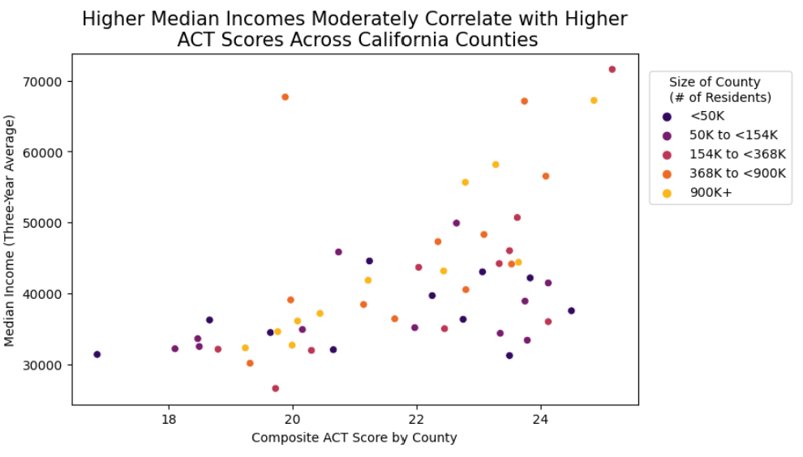
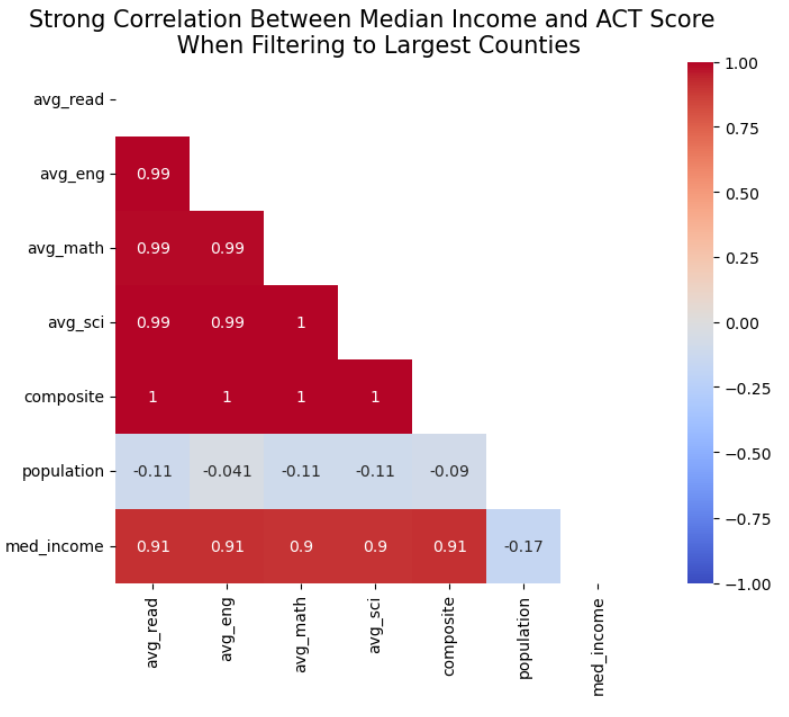
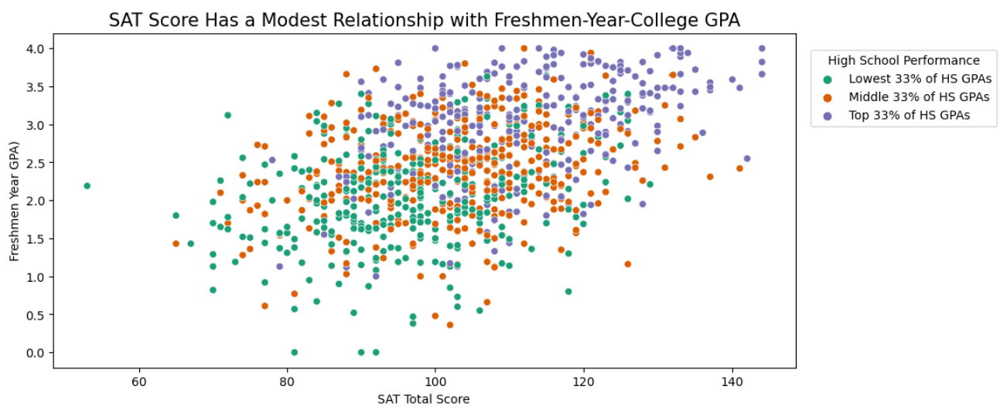

# Exploration of Median Income and ACT Score Across California Counties & Predictors of College Performance

# Problem Statement
The University of California (UC) school system[^](#fn1) voted in 2020 to phase out standardized testing requirements as part of their admissions processes, stating that these tests add little value in predicting college performance and are discriminatory against low-income groups ([*1*](https://edsource.org/2019/lawsuits-seek-to-end-university-of-californias-sat-or-act-test-requirement-for-freshman-admission/620921#:~:text=The%20lawsuit%2C%20Kawika%20Smith%20v,income%2C%20black%20and%20Latino%20students)). As such, UC considered instating its own content-based standardized test in place of the SAT/ACT to assess student academic readiness ([*2*](https://regents.universityofcalifornia.edu/regmeet/may20/b4.pdf)) whilst remaining test-blind in the interim. As of June 2021, the UC school system has remained test-blind, not considering SAT/ACT scores for admission, and it remains to be seen if a new UC-specific test will come into fruition. As a large and influential institution, it is important that the UC school system consider all aspects of their decision to eliminate the SAT/ACT completely by 2025, ([*3*](https://www.calstate.edu/csu-system/news/Pages/Explained-Admissions-Without-the-SAT-or-ACT.aspx#:~:text=In%20March%202022%2C%20the%20CSU,not%20required%20for%20CSU%20applicants)) and examine the data around claims of fairness to low-income students and associations between standardized testing and college performance. They should then use these insights to inform the assumptions around any UC-based exam they may generate. 

The objective of this project is to begin a preliminary exploratory data analysis on 1) the relationship between standardized test scores and socioeconomic status, as defined by median income, across California counties, and on 2) the general relationship between standardized test scores and high school GPA as well as freshmen year of college GPA. This exploration will result in recommendations for where further resources may be directed, or whether it is appropriate to eliminate standardized testing from admissions processes altogether by 2025.

 [^](#fn1)[*See here for list of 10 institutions*](https://www.csusb.edu/cal-soap/prepare-college/university-california-schools) 

# Data Dictionary

Below are data dictionaries for the main data frames used in this exploration. Data from sources such as the Franchise Tax Board (FTB) and the Educational Testing Services (ETS) were used for this exploration and merged into SAT/ACT data, see below for sources.

|Feature|Type|Dataset|Description|
|---|---|---|---|
|**county**|*object*|ACT_CA_COUNTY|The California county | 
|**n_enrolled**|*integer*|ACT_CA_COUNTY|The number of students across the various schools in the CA county (based on 2019 data)|
|**n_testtaker**|*integer*|ACT_CA_COUNTY|The number of students across the various schools in the CA county who took the ACT (based on 2019 data)|
|**avg_read**|*float*|ACT_CA_COUNTY|The average ACT Reading score of students across schools within the CA county (based on 2019 data)|
|**avg_eng**|*float*|ACT_CA_COUNTY|The average ACT English score of students across schools within the CA county (based on 2019 data))|
|**avg_math**|*float*|ACT_CA_COUNTY|The average ACT Math score of students across schools within the CA county (based on 2019 data)|
|**avg_sci**|*float*|ACT_CA_COUNTY|The average ACT Science score of students across schools within the CA county (based on 2019 data)|
|**composite**|*float*|ACT_CA_COUNTY|The average composite ACT score of schools in the CA county (based on 2019 data, calculated as the average of the county level Reading, English, Math, and Science score)|
|**population**|*float*|ACT_CA_COUNTY|The three-year-average (2017-2019) CA county population|
|**med_income**|*float*|ACT_CA_COUNTY|The three-year-average (2017-2019) median income per CA county of students across the various schools in the CA county|
source of income data: https://data.ftb.ca.gov/California-Personal-Income-Tax/pit_B6-Comparison-By-County-Median-Income-/8dv7-kphc

|Feature|Type|Dataset|Description|
|---|---|---|---|
|**sex**|*object*|ETS_SAMPLE|The sex of the student (Male/Female) among a 1,000 student sample| 
|**sat_verbal**|*integer*|ETS_SAMPLE|The SAT Evidence-Based Reading and Writing score of the student among a 1,000 student sample (numbers are divided by 100)|
|**sat_math**|*integer*|ETS_SAMPLE|The SAT Math score of the student among a 1,000 student sample (numbers are divided by 100)|
|**sat_total**|*integer*|ETS_SAMPLE|The total SAT score of the student among a 1,000 student sample (numbers are divided by 100)|
|**gpa_hs**|*float*|ETS_SAMPLE|The high school GPA of the student among a 1,000 student sample (numbers are divided by 100)|
|**gpa_fy**|*float*|ETS_SAMPLE|The freshmen-year-college GPA of the student among a 1,000 student sample (numbers are divided by 100)|
source: https://www.openintro.org/data/index.php?data=satgpa

# Executive Summary

## Background and Problem Statement
The University of California (UC) school system is one of the most influential in the nation, with students seeking to attend from around the world. The admissions-process decisions made by the schools affect countless hopeful applicants, and can get the tone for other university practices. Due to the COVID-19 pandemic, UC schools abandoned the standardized testing requirement, but attempts to eradicate it had started as early as December 2019. 
UC claims that standardized tests add little value in predicting college performance and are discriminatory against low-income groups. The test has not been reinstated post-pandemic, and UC intends to eliminate it completely by 2025. The claims that it is discriminatory and not predictive of further educational success are challenges to be investigated further. 
This project sought to further explore the following to begin addressing these challenges: 1) the presence/strength of an association between median income and standardized test scores, and 2) the best predictor of college performance between the SAT and high school (HS) GPA. 

## Initial Findings
The data showed that there was a moderate correlation between median income per county and ACT score, and also that there were moderate correlations between HS GPA/SAT score and freshmen year (FY) of college GPA. There were certain criteria that made correlations more significant, such as size of county (number of residents), or top/bottom quartiles of HS performance.

## Methodology and Analysis
The complete this exploration, the following steps and substeps were performed.
#### 1. Data Acquisition
- 2017-2019 SAT and ACT score data by state is available on Kaggle 
- 2019 SAT and ACT granular school/district/county data for the state of California is available on Kaggle
- Median income data was pulled from two sources: the US Census Bureau (Median Household Income by State - 3 Year Average) for state level data, and Franchise Tax Board for county level data 
- SAT, HS GPA, and FY GPA data was pulled from a dataset created by the Educational Testing Services (ETS) on a sample of 1,000 students
#### 2. Data Cleaning
- For each dataset, the following cleaning actions were executed:
    - Descriptive statistics exploration for anomalous data
    - Data type updates
    - Filtering or otherwise updating anomalous data
    - Missing data processing
- The 2017-2019 ACT and SAT datasets by state were stacked (based on the respective test) and average scores were taken across all three years. If data was not present for any years, only available data was used. For example, subject-specific ACT scores were not available beyond 2017, but composite scores were. Composite scores, therefore, were aggregated across all years, but subject specific scores used were the 2017 figures. Median income was gathered at the state level and merged in to the data frame.
- 2019 California datasets (for both ACT and SAT) were aggregated to the county level by summing across the appropriate columns (e.g., student enrollment) and averaging across the appropriate columns (e.g., test score). Median income was gathered at the county level and merged into the data frame.
- ETS data was  largely analysis ready
#### 3. Data Exploration
- The following prompts were explored:
    - Which CA counties have the lowest/highest income and ACT scores?
        - Data was sorted by median income and the top 10 and bottom 10 observations were observed.
        - Data was sorted by average ACT score and the top and bottom 10 counties were observed.
- What is the relationship between median income and ACT scores?
    - Median income was split into quartiles (Top 25%, Bottom 25%, etc.) based on county (each quartile had an equal number of counties in it.
    - ACT scores were split into quartiles (Top 25%, Bottom 25%, etc.)
    - Crosstabulations were made to gauge patterns between high/low median income and high/low ACT score.
- Do larger counties have higher median income and/or ACT scores?
    - County size as a category was generated into quintiles: Very Small, Small, Medium, Large, Very Large based on the relative distributions across all counties. 
    - County size category was cross-tabulated with the ACT group category and separately with the median income group category
- How many standard deviations above/below is each counties median income/SAT compared to the state?
    - Z scores were generated using descriptive statistics get mean and standard deviation
    - Data was sorted by highest and lowest Z scores to see the magnitude of spread
- Among those scoring low on the SAT, what is their average HS GPA vs. FY GPA?
    - Data was filtered to low SAT scores which were first defined as below the median score, and average HS GPA was compared with the students average FY GPA 
    - Low SAT scores were redefined as being in the bottom 25%, and the comparison was repeated.
#### 4. Data Visualization
- Histograms were generated on the main variables of interest: median income and ACT score
- A barchart showing all 54 CA counties and their median incomes was created
- Boxplots represented the distribution of SAT subject test scores
- Scatterplots were generated on ACT score and median income
- Heatmaps accompanied scatterplots to look at the correlation coefficients between numerical data fields: composite ACT score, median income, county population, and individual ACT subject test scores
- Additional heatmaps were produced to look at a subset of ACT by median income data
- Correlations between median income and ACT score increase depending on county size; larger counties have the strongest positive correlation
- Scatterplots were generated on HS GPA by FY GPA, as well as SAT score and FY GPA, and HS GPA and SAT score
- A heatmap was produced to look at the correlation coefficients between HS GPA, SAT score, and FY GPA

#### 5. Key Findings and Insights 

Based on this exploration, there are two main conclusions drawn in relation to our original problem statement.
- There appears to be a moderate positive correlation (R = 0.53) between median income and ACT score for California counties. 
    - This correlation gets stronger for larger counties - the largest counties (900K+ residents) had a strong linear correlation (R = 0.91)
    - The correlation is strong, but milder, for medium sized counties (0.77) and weaker, comparatively, for small counties (R = 0.40)
    

- High School GPA and SAT scores both have scattered and modest relationships with first-year college performance. 
    - This relationship looked slightly stronger for females than males.
    - Among the student sample data (n = 1000), HS GPA had a slightly stronger correlation to FY GPA than SAT score did (0.54 vs. 0.46).
    - The relationship between SAT score and FY college performance had the highest correlation for students who were higher performers in high school. This suggests that, for the most part, high HS GPA coupled with strong SAT scores were the best predictor of college success.
    

#### 6. Conclusion and Next Steps

Larger counties have a wider range of socioeconomic backgrounds, social disparities, and inequalities, making the correlation between ACT scores and median income more prominent in these areas. We recommend that larger counties invest more resources in access to SAT/ACT preparatory resources and, most importantly, school-funding to assure students across all schools are prepared for post-high-school studies. This would improve outcomes for not only college performance, but allow the SAT/ACT to be additional positive data points for students to present during college admissions.
 
There is not enough data to say definitively that either the SAT or HS GPA are more accurate or best predictors of success in college. By and large, both coupled together still appear to be strong indicators of college success. Higher FY GPAs among students who had high HS GPAs and good SAT scores make retention and graduation more likely. We recommend UC schools consider bringing standardized testing back into their schools by 2025, the time period in which they intend to completely eliminate the test for admissions processes. The data looked at in this exploration is largely California data, but students seek admissions to UC schools from all over the world - therefore, an additional factor that is more standardize than HS GPA may be beneficial in admitting the best-fit students.

More multivariate analyses and continuing investigations will be helpful in predicting the relationship between HS performance and college performance, as well as the impact that income has on standardize test outcomes despite free preparatory resources available (e.g., Khan Academy, College Board, etc.). It will be beneficial to all students and professionals if resources continue to be directed to finding the root cause of disparities, whether that be standardized testing or otherwise.

